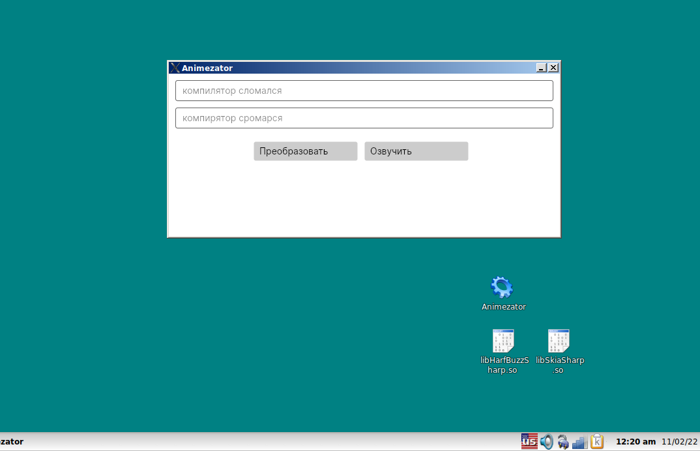
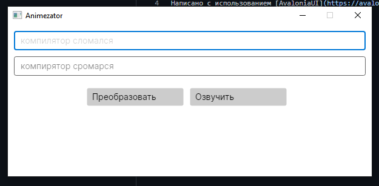

# Animezator
## Приложение заменяющие все "Л" на "Р" в тексте, и озвучивающее результат
### РАБОТАЕТ ДАЖЕ НА ГРЁБАННОМ ЛИНУКСЕ!!!111!!1!
Написано с использованием [AvaloniaUI](https://avaloniaui.net/) и [NetCoreAudio](https://github.com/mobiletechtracker/NetCoreAudio)
> Скриншоты сделанные на Q4OS(дистрибутив линупса) и Win10
>  
